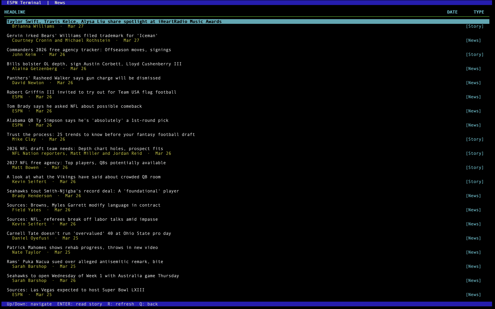

# TERMSPN

## Sports stats for the terminal — no bloat, no ads, no browser required

TERMSPN is a POSIX-compliant terminal application that pulls live standings and team data directly from ESPN's public API. Navigate leagues, browse standings, and drill into team details without ever leaving your shell.


---

## Features

- **Live standings** — NBA and NFL standings pulled from ESPN, cached per session for instant navigation
- **Conference split** — East/West and AFC/NFC displayed in order, sorted by win percentage
- **Per-team detail** — overall record, home/away splits, division and conference records, last 10 games, PPG, OPP PPG, point differential, and current streak
- **Keyboard-driven navigation** — no mouse required
- **Streak coloring** — win streaks highlighted green, loss streaks red
- **News feed** — league news fetched alongside standings; browse headlines and read full stories in-app
- **Session caching** — standings and news are fetched once per league per session; press `R` to force a refresh
- **Minimal dependencies** — ncurses and libcurl, nothing else

---



## Dependencies

| Library | Purpose |
| --- | --- |
| `ncurses` | Terminal rendering |
| `libcurl` | HTTP requests to ESPN API |
| `nlohmann/json` | JSON parsing (header-only, included) |

**Install dependencies:**

```bash
# Debian / Ubuntu
sudo apt install libncurses-dev libcurl4-openssl-dev

# macOS
brew install ncurses curl
```

---

## Installation

```bash
git clone https://github.com/yourname/termspn.git
cd termspn
make
```

| Command | Description |
| --- | --- |
| `make` | Compile the program |
| `make run` | Build (if needed) and run |
| `make clean` | Remove compiled files |

---

## Usage

Launch with:

```bash
./espn
```

### Controls

| Key | Screen | Action |
| --- | --- | --- |
| `↑` / `↓` | Any | Navigate up and down |
| `Enter` | League Select / Standings / News List | Select / confirm |
| `N` | Standings | Open news feed for current league |
| `R` | Standings / News List | Force-refresh data from ESPN |
| `Q` | Any | Go back / quit |
| `Esc` | Team Detail / News Detail | Return to previous screen |

### Navigation flow

```
League Select  →  Standings  →  Team Detail
      ↑               |  ↑            |
      |               |  └────────────┘
      |               ↓
      |           News List  →  News Detail
      |               ↑              |
      |               └──────────────┘
      └─────── Q from Standings
```

### Caching

Standings and news are both fetched from ESPN when you first enter a league. If you navigate back to League Select and re-enter the same league, both are served from the session cache immediately — no network call.

Press `R` on the Standings or News List screen to discard the cache for that data and pull fresh content from ESPN.

Individual story bodies are fetched on demand when you open an article, and are held in the session cache for the remainder of that league visit.

All cached data is held in memory only and is discarded automatically when the app exits. Nothing is written to disk.

---

## Data Source

All data is sourced from ESPN's public API (`site.api.espn.com`). No API key is required.

---

## Roadmap

- [ ] More leagues (MLB, NBA, NHL, MLS)
- [ ] Scores and live game updates
- [ ] Player stats view
- [ ] Configurable refresh interval
- [ ] Color theme support

---

## License

MIT
