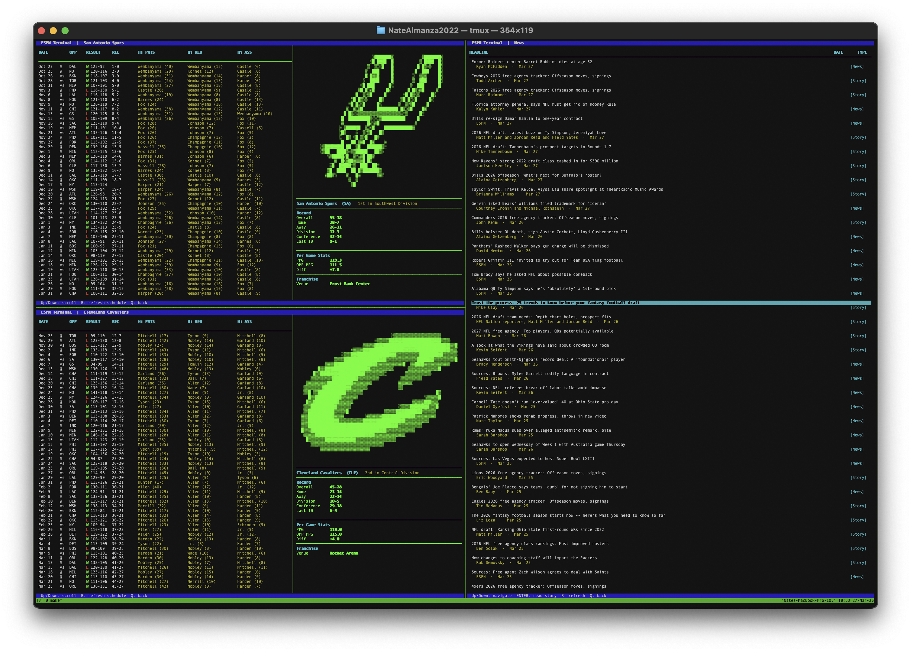

# TERMSPN

## Sports stats for the terminal — no bloat, no ads, no browser required

TERMSPN is a POSIX-compliant terminal application that pulls live standings and team data directly from ESPN's public API. Navigate leagues, browse standings, and drill into team details without ever leaving your shell.



---

## Features

- **Live standings** — NBA and NFL standings pulled from ESPN, cached per session for instant navigation
- **Conference split** — East/West and AFC/NFC displayed in order, sorted by win percentage
- **Per-team detail** — overall record, home/away splits, division and conference records, last 10 games, PPG, OPP PPG, point differential, and current streak
- **Game log** — full season schedule shown alongside team stats: date, home/away, opponent, W/L result, final score, team record, and stat leaders (points, rebounds, assists) for each completed game
- **Keyboard-driven navigation** — no mouse required
- **Streak coloring** — win streaks highlighted green, loss streaks red
- **News feed** — league news fetched alongside standings; browse headlines and read full stories in-app
- **Session caching** — standings, news, and per-team schedules are each fetched once per session; press `R` on any screen to force a refresh
- **Minimal dependencies** — ncurses and libcurl, nothing else

---
### Demo (Standings)


---
### Demo (NEWS)


## Dependencies

| Library | Purpose |
| --- | --- |
| `ncurses` | Terminal rendering |
| `libcurl` | HTTP requests to ESPN API |
| `nlohmann/json` | JSON parsing (header-only, included) |

**Install dependencies:**

```bash
# Debian / Ubuntu
sudo apt install libncurses-dev libcurl4-openssl-dev

# macOS
brew install ncurses curl
```

---

## Installation

```bash
git clone https://github.com/yourname/termspn.git
cd termspn
make
```

| Command | Description |
| --- | --- |
| `make` | Compile the program |
| `make run` | Build (if needed) and run |
| `make clean` | Remove compiled files |

---

## Usage

Launch with:

```bash
./espn
```

### Controls

| Key | Screen | Action |
| --- | --- | --- |
| `↑` / `↓` | Any | Navigate up and down |
| `Enter` | League Select / Standings / News List | Select / confirm |
| `N` | Standings | Open news feed for current league |
| `R` | Standings / Team Detail / News List | Force-refresh data from ESPN |
| `Q` / `Esc` | Any | Go back / quit |

### Navigation flow

```
League Select  →  Standings  →  Team Detail  (schedule + stats, R to refresh)
      ↑               |  ↑            |
      |               |  └────────────┘ Q
      |               ↓
      |           News List  →  News Detail
      |               ↑              |
      |               └──────────────┘ Q
      └─────── Q from Standings
```

### Caching

TERMSPN uses three in-memory caches — nothing is ever written to disk.

| Cache | Key | Populated when | R refreshes on |
| --- | --- | --- | --- |
| Standings | League | League first selected | Standings screen |
| News | League | League first selected | News List screen |
| Schedule | Team ID | Team first visited | Team Detail screen |

Each cache entry is populated once on first access and reused for the rest of the session. Navigate back and forward freely — cached screens respond instantly without hitting the network.

Press `R` on Standings, Team Detail, or News List to evict that entry and re-fetch from ESPN.

Individual story bodies are lazy-fetched when you open an article and cached for the rest of that session.

All data is discarded automatically when the app exits.

---

## Data Source

All data is sourced from ESPN's public API (`site.api.espn.com`). No API key is required.

---

## Roadmap

- [ ] More leagues (MLB, NBA, NHL, MLS)
- [ ] Scores and live game updates
- [ ] Player stats view
- [ ] Configurable refresh interval
- [ ] Color theme support

---

## License

MIT
