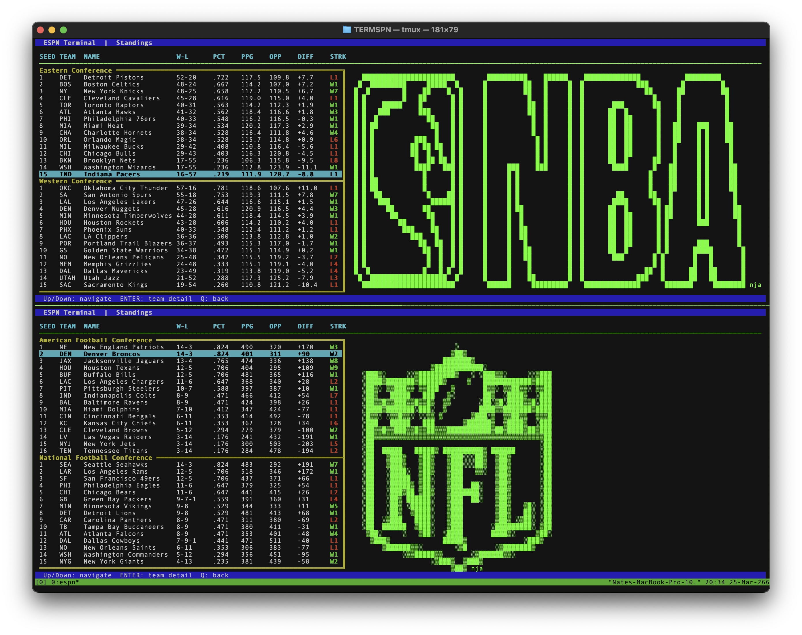

# TERMSPN
## "Sports stats for the Terminal"

This project currently supports NBA and NFL standings, more in depth data visualization coming soon.

#### Dependancies:
- ncurses

#### INSTALLATION
you are going to need to compile this first, simply:

- make → compiles the program.
- make run → builds (if needed) and then runs it.
- make clean → removes compiled files.

#### SCREENSHOTS

